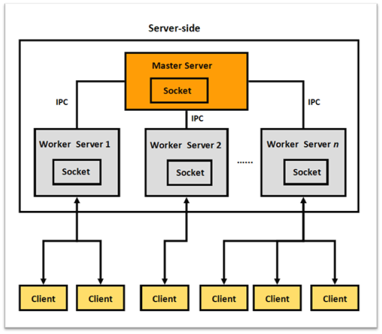

# Collaborative Whiteboard

**Task:** Design and develop a Cloud-based Collaborative Whiteboard that can be shared between multiple users over the network in a distributed environment. Your whiteboard should support for basic drawing features such as line, circle, and rectangle as well as text anywhere in the whiteboard.

The whiteboard should have the following features:

1. Distributed System Design
2. Distributed State Management
3. Consensus and Leadership
4. Replication
5. Performance and concurrency

---

## Architecture



### Tech Stack

- Backend
  - Node.js
  - Socket.IO & Redis
  - MongoDB

- Frontend
  - Bootstrap
  - HTML5 & CSS
  - Fabric.js
---

### Installation & Usage

**Prerequisites:** Before you can run the application, you need to ensure you have the following prerequisites are installed:

- Redis server
- _Ensure [Node.js](https://nodejs.org/en/) and [NPM](https://www.npmjs.com/) are installed._

#### How to run

1. Clone or download the repo.

    ```
    git clone https://github.com/moh-i-ahmed/collaborativeWhiteboard
    ```

2. Start the application.

    ```
    node index.js
    node index
    npm start
    ```

3. After the application starts, visit [http://localhost:8080](http://localhost:8080) to view it in the browser. webpage.
